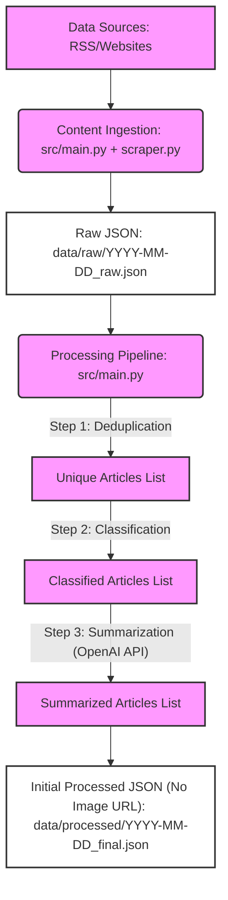
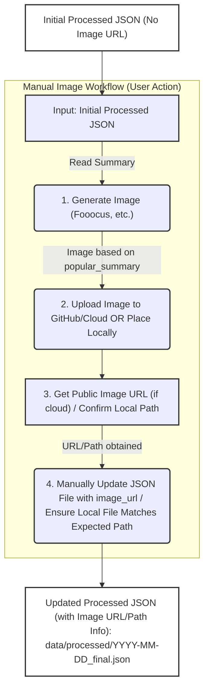

# AI Popular Science Express

This project is an AI-driven news summarization system with a core focus on science popularization. It automates the daily fetching of content from several high-quality AI-related websites. This content is then initially processed by language models (with future plans for deduplication and classification) and summarized into a popular science style using Large Language Models (currently OpenAI API). Finally, the processed content is organized and published as daily e-newsletter pages using the Hugo static site generator.

## Project Goal

* To automatically aggregate the latest information in the AI field from multiple authoritative sources daily.
* To leverage AI technology (especially LLMs) to transform professional and complex AI news into content that is easily understandable for non-experts.
* To provide a clean, readable daily e-newsletter website for users to track AI developments.
* To offer a high-quality information portal for readers interested in AI.

## Current Features (MVP Stage)

* **Automated Content Ingestion**:
    * Supports fetching from RSS Feeds (e.g., Google AI Blog, MIT Technology Review).
    * Supports basic web scraping (e.g., Stanford HAI News, using `requests` + `BeautifulSoup4`).
    * Raw ingested data (including title, link, original publication date, summary/full text) is saved as daily JSON files.
* **AI Content Processing Engine**:
    * **Text Deduplication**: Uses `sentence-transformers` for semantic similarity calculation to identify and filter duplicate content.
    * **Automatic Content Classification**: Utilizes Hugging Face `transformers` zero-shot classification models to assign articles to predefined categories.
    * **Popular Science Summary Generation**: Calls the OpenAI API (GPT series models) with carefully designed prompts to generate popular science style summaries for articles.
* **Manual Image Integration Workflow**:
    * Users can manually generate images for summaries using tools like Fooocus based on the AI-generated summary.
    * The system identifies and links these manually placed images in the generated Markdown based on agreed-upon naming conventions and paths.
* **Markdown E-Newsletter Generation**:
    * Organizes processed articles (including classification, popular science summary, and manual image references) by predefined category order into daily Markdown files.
    * Markdown files include Front Matter (title, date) compatible with Hugo.
* **Static Website Presentation**:
    * Uses Hugo static site generator.
    * Provides basic website layouts (homepage, archive page, single e-newsletter issue page).
    * Basic CSS styling for readability and responsive design.

## Tech Stack

* **Main Language**: Python 3.10
* **Static Site Generator**: Hugo

## System Workflow Diagram

The following diagram illustrates the overall workflow of the AI Popular Science Express system, from data ingestion to newsletter generation:




## Setup and Installation

1.  **Clone the repository**:
    ```bash
    git clone 
    ```
2.  **Create and activate a Python virtual environment**:
    ```bash
    python3 -m venv venv  # Or python -m venv venv
    source venv/bin/activate  # macOS/Linux
    ```
3.  **Install Python dependencies**:
    ```bash
    pip install -r requirements.txt
    ```
4.  **Install Hugo**:
    Please refer to the [official Hugo documentation](https://gohugo.io/getting-started/installing/) for installation instructions based on your operating system. Ensure the `hugo` command is available in your PATH.
5.  **Set up Environment Variables**:
    You will need an OpenAI API key. Set your key as an environment variable named `OPENAI_API_KEY`.
    ```bash
    export OPENAI_API_KEY='sk-YourOpenAIKeyHere'
    ```
    It's recommended to add this line to your shell's configuration file (e.g., `~/.bashrc`, `~/.zshrc`).

## How to Run the System

1.  **Run the daily data processing and Markdown generation pipeline**:
    In the project root directory, with the virtual environment activated:
    ```bash
    python src/main.py
    ```
    This script will:
    * Fetch the latest articles from configured sources and save raw data to `data/raw/`.
    * Deduplicate, classify, and generate popular science summaries for the fetched articles, saving processed data to `data/processed/`.
    * Generate Markdown files from the processed articles and save them to `newsletter_site/content/newsletter/`.

2.  **Manual Image Processing Workflow (Optional)**:
    * Review `data/processed/YYYY-MM-DD_final_ai_news.json` to find the `image_expected_filename` and `popular_summary` for articles you want to add images to.
    * Use tools like Fooocus to generate images based on the `popular_summary`.
    * Name the generated image exactly as the value in `image_expected_filename` (e.g., `2025-06-01_some_slug.png`).
    * Place the image in `newsletter_site/static/images/manual_summaries/YYYY-MM-DD/` (where YYYY-MM-DD is the current date).
    * Re-run `python src/main.py` (or just `python src/output/markdown_generator.py --date YYYY-MM-DD` if you implemented the date argument) to update the Markdown files to include image references.

3.  **Preview the Hugo website locally**:
    Navigate to the Hugo site directory and start the development server:
    ```bash
    cd newsletter_site
    hugo server -D
    ```
    Then open `http://localhost:1313/ai-news-summarizer/` (or the corresponding local path for your `baseURL` setting) in your web browser.

## Current Data Sources

* Google AI Blog (RSS)
* Stanford HAI News (Web Scraping)
* MIT Technology Review - AI Section (RSS)
* Partnership on AI Blog (Web Scraping - effectiveness needs monitoring and maintenance)

## Future Development

* Implement more robust scrapers for Partnership on AI Blog and other potential sources.
* Improve full-text extraction and date parsing logic for all sources.
* Continuously refine prompt engineering for popular science summaries.
* Enhance the accuracy of the classification model (e.g., consider fine-tuning).
* More sophisticated Hugo website templates and CSS styling.
* Implement automated deployment to GitHub Pages or other static site hosting platforms.
* Expand the list of high-quality AI information sources.
* Consider adding an email subscription feature.

## License

This project is licensed under the [MIT License](LICENSE). (If you haven't created a `LICENSE` file yet, it's recommended to choose one, e.g., MIT, and create the file).